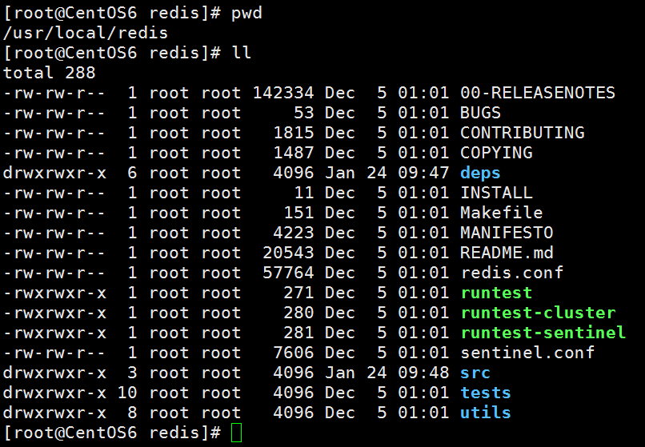
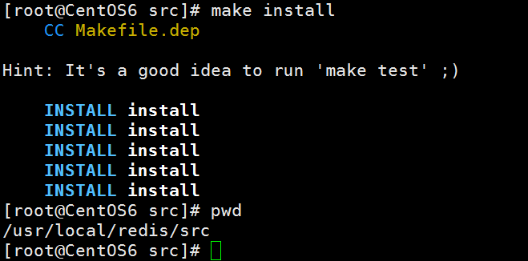

# Linux 下 Redis 的安装和部署

### 一、**Redis 介绍**

​ Redis 是当前比较热门的 NOSQL 系统之一，它是一个 key-value 存储系统。和 Memcache 类似，但很大程度补偿了 Memcache 的不足，它支持存储的 value 类型相对更多，包括 string、list、set、zset 和 hash。这些数据类型都支持 push/pop、add/remove 及取交集并集和差集及更丰富的操作。在此基础上，Redis 支持各种不同方式的排序。
​ 和 Memcache 一样，Redis 数据都是缓存在计算机内存中，不同的是，Memcache 只能将数据缓存到内存中，无法自动定期写入硬盘，这就表示，一断电或重启，内存清空，数据丢失。所以 Memcache 的应用场景适用于缓存无需持久化的数据。而 Redis 不同的是它会周期性的把更新的数据写入磁盘或者把修改操作写入追加的记录文件，实现数据的持久化。

### 二、Redis 安装

#### 1、首先上官网下载 Redis 压缩

```
地址：http://redis.io/download 下载稳定版5.0.0即可。通过远程管理工具，将压缩包拷贝到Linux服务器中。
```

**_或者使用直接下载的方式来代替_**

```$ wget http://download.redis.io/releases/redis-5.0.0.tar.gz$ tar xzf redis-5.0.0.tar.gz$ cd redis-5.0.0$ make
[root@CentOS6 ~]#  wget http://download.redis.io/releases/redis-5.0.0.tar.gz
```

#### 2、执行解压操作（解压到指定的路径下）

```linux
[root@CentOS6 ~]# tar zxvf redis-5.0.0.tar.gz -C /usr/local/
[root@CentOS6 ~]# cd /usr/local/
[root@CentOS6 local]# ls
apache-tomcat-8.5.24 etc include lib64 libexec memcached nginx-1.8.0 sbin src
bin games lib libevent maven-3.5.2 nginx redis-5.0.0
```

#### 3、执行 make 对解压后的文件进行编译（在解压后的 redis 目录的路径下）

```
[root@CentOS6 redis-5.0.0]# pwd
/usr/local/redis-5.0.0
[root@CentOS6 redis-5.0.0]# ls
00-RELEASENOTES  COPYING  Makefile   redis.conf       runtest-sentinel  tests
BUGS             deps     MANIFESTO  runtest          sentinel.conf     utils
CONTRIBUTING     INSTALL  README.md  runtest-cluster  src
[root@CentOS6 redis-5.0.0]# make
```

##### 编译完成之后，可以看到解压文件 redis 中会有对应的 src、conf 等文件夹，这和 windows 下安装解压的文件一样，大部分安装包都会有对应的类文件、配置文件和一些命令文件。（这里的路径是将 redis5.0.0 重命名为 redis 了）



#### 4、编译成功后，进入 src 文件夹，执行 make install 进行 Redis 安装

```
[root@CentOS6 redis]# make install
```



### 三、Redis 的部署

安装成功后，下面对 Redis 进行部署

**主要是方便管理 redis 和设置 redis 开机自启（可按照自己的需求进行设定）**

#### 1、首先为了方便管理，将 Redis 文件中的 conf 配置文件和常用命令移动到统一文件中

##### a)创建 bin 和 etc 文件夹

```
[root@CentOS6 redis]# mkdir -p /usr/local/redis/bin
[root@CentOS6 redis]# mkdir -p /usr/local/redis/ect
```

##### b)执行 Linux 文件移动命令：

```
[root@CentOS6 redis]# mv redis.conf etc/
[root@CentOS6 redis]# cd src/
[root@CentOS6 src]# mv mkreleasehdr.sh redis-benchmark redis-check-aof redis-cli redis-server /usr/local/redis/bin
```

#### 2、后台启动 redis 服务

##### a) 切换到/usr/local/redis/etc 目录，编辑 redis.conf 文件,将 daemonize 属性改为 yes（表明需要在后台运行）

```
[root@CentOS6 etc]# vim redis.conf
```

##### **b)切换到/usr/local/redis/bin 目录下执行**Redis-server 命令，使用/usr/local/redis/etc/redis.conf 配置文件来启动 Redis 服务

```
[root@CentOS6 redis]# cd bin/
[root@CentOS6 bin]# ls
mkreleasehdr.sh  redis-benchmark  redis-check-aof  redis-cli  redis-server
[root@CentOS6 bin]# ./redis-server /usr/local/redis/etc/redis.conf
```

#### 3、服务端启动成功后，执行 redis-cli 启动 Redis 客户端，查看端口号,默认是 6379。（表示已经连上 redis 数据库）

```
[root@CentOS6 bin]# redis-cli
127.0.0.1:6379>
```

#### 4、编辑服务启动脚本文件（ 启动脚本 redis_init_script 位于位于 Redis 的 /utils/ 目录下）

##### a) 根据启动脚本，将启动脚本复制到/etc/init.d 目录下，本例将启动脚本命名为 redisd（通常都以 d 结尾表示是后台自启动服务）。用 root 用户进行操作：

```
[root@CentOS6 utils]# cp redis_init_script /etc/init.d/redisd
```

##### b) 编辑移动后的文件

```
vim /etc/init.d/redisd
```

##### c) 脚本中内容入下：

```
#!/bin/sh
# redis        Startup script for Redis Server
# chkconfig: - 80 12
# description: Redis is an open source, advanced key-value store.
# processname: redis-server
# config: /usr/local/redis/etc/redis.conf
# pidfile: /var/run/redis.pid
source /etc/init.d/functions
BIN="/usr/local/redis/bin"
CONFIG="/usr/local/redis/etc/redis.conf"
PIDFILE="/var/run/redis.pid"
### Read configuration
[ -r "$SYSCONFIG" ] && source "$SYSCONFIG"
RETVAL=0
prog="redis-server"
desc="Redis Server"
start() {
        if [ -e $PIDFILE ];then
             echo "$desc already running...."
             exit 1
        fi
        echo -n $"Starting $desc: "
        daemon $BIN/$prog $CONFIG
        RETVAL=$?
        echo
        [ $RETVAL -eq 0 ] && touch /var/lock/subsys/$prog
        return $RETVAL
}
stop() {
        echo -n $"Stop $desc: "
        killproc $prog
        RETVAL=$?
        echo
        [ $RETVAL -eq 0 ] && rm -f /var/lock/subsys/$prog $PIDFILE
        return $RETVAL
}
restart() {
        stop
        start
}
case "$1" in
  start)
        start
        ;;
  stop)
        stop
        ;;
  restart)
        restart
        ;;
  condrestart)
        [ -e /var/lock/subsys/$prog ] && restart
        RETVAL=$?
        ;;
  status)
        status $prog
        RETVAL=$?
        ;;
   *)
        echo $"Usage: $0 {start|stop|restart|condrestart|status}"
        RETVAL=1
esac
exit $RETVAL
```

##### d) 设置为开机自启动，直接配置开启自启动 chkconfig redisd on

若发现错误： service redisd does not support chkconfig，

解决办法，在启动脚本开头添加或修改如下注释来修改运行级别：

```
#!/bin/sh
# chkconfig:   2345 90 10
```

##### e) 设置这个文件的权限 (若是 chmod a+x ...; 则 a+x 参数表示 ==> all user can execute 所有用户可执行)

```
chmod +x /etc/init.d/redisd
```

##### f) 设置环境变量，并使之生效

```
vim /etc/profile.d/redis.sh

export REDIS_HOME=/usr/local/redis
export PATH=$PATH:$REDIS_HOME/bin

#source /etc/profile.d/redis.sh
```

##### g) 配置下面的内核参数，否则 Redis 脚本在重启或停止 redis 时，将会报错，并且不能自动在停止服务前同步数据到磁盘上/etc/sysctl.conf 加上

```
#vim /etc/sysctl.conf

vm.overcommit_memory = 1

#sysctl -p
```

##### 后续操作

```
#查看开机自启动服务
chkconfig --list
#添加redis到开机自启动服务
chkconfig --add redisd
#添加redis到开机自启动服务
chkconfig --del redisd
#设置为开机自启动服务器
chkconfig redisd on
#打开服务
service redisd start
#关闭服务
service redisd stop
```

---

**附：Redis 常用操作**

```
./redis-server /usr..../redis.conf 启动redis服务，并指定配置文件
redis-cli 启动redis 客户端
pkill redis-server 关闭redis服务
redis-cli shutdown 关闭redis客户端
netstat -tunpl|grep 6379 查看redis 默认端口号6379占用情况
```
